# My Life Map

Daily logs → auto-linked timeline with clickable dots.

## 📍 Life Map

```mermaid
graph LR
  D20250823(("●"))
  D20250824(("●"))
  D20250827(("●"))
  D20250823 --- D20250824
  D20250824 --- D20250827
  click D20250823 "https://github.com/Bennnto/journey//blob/main/logs/2025-08-23.md" "2025-08-23"
  click D20250824 "https://github.com/Bennnto/journey//blob/main/logs/2025-08-24.md" "2025-08-24"
  click D20250827 "https://github.com/Bennnto/journey//blob/main/logs/2025-08-27.md" "2025-08-27"
```

<!-- LIFE_MAP_START -->

<!-- LIFE_MAP_END -->

## 📚 About
- Each log lives in `logs/YYYY-MM-DD.md`.
- Optional front-matter lines at the top:
  - `Title: your short title`
  - `Goal: #<issue_number>` or `Struggle: #<issue_number>`
  - `Tags: comma,separated`

## 🗂️ Goals & Struggles
- Track them as **Issues** in this repo.
- Use labels like `goal` or `struggle` to organize.
